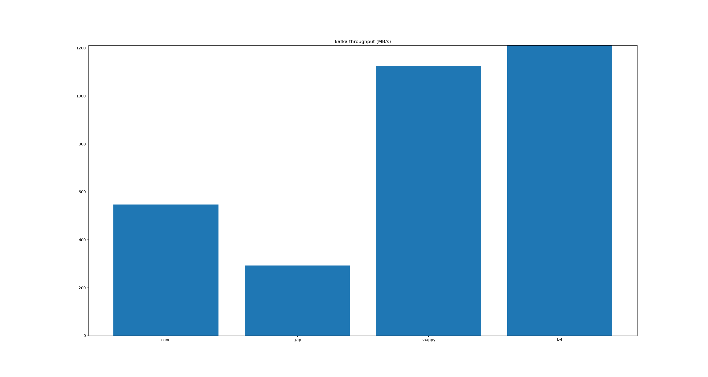
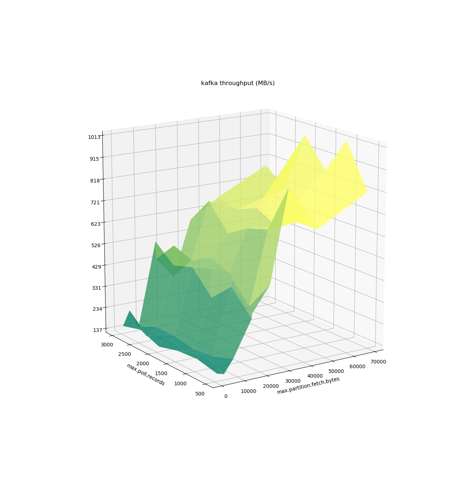

# Kafka poor man's benchmarker

The poor man's benchmarker is a set of pyton script and java code to benchmark different kafka configuration and generate graphs from the result. It's composed of two utilities

* _python bench.py_: An utility to start benchmarking Kafka
* _python graph.py_: An utility to render graphs from the benchmark results

## Installation

The following application need to be available in your path as a prerequisites:

* gcc: Requirement for matplotlib 
* python-devel: Requirement for matplotlib
* pip: To install all required libraries
* kafka-topics: Used in the benchmarker to create and delete topic 
* dstat: Used to gather performance metrics
* maven: Used to build the java driver

To install the required libraries in python, please execute:

```bash
pip install -r requirements.txt
```

To compile the java driver, please execute:

```bash
(cd java/driver && mvn package)
```

## Benchmarking

```bash
# Sequentially execute all test in the "properties" directory
python bench.py

# Execute the tests provided 
python bench.py <test1.json> <test2.json>
``` 

## Plot results

```bash
# Render a graph of the result
# Note: You need to have a user interface running (e.g. X11)
python graph.py <result.out> 
``` 

## Configuration

Global configuration and properties are available in the _configuration.json_ file. If you need to configure different properties for the KafkaConsumer or KafkaProducer (e.g. TLS configuration, Authentication, etc...), put all the required properties in this file in a JSON format. Note: the _bootstrap.servers_ is a required attributes. Example of configuration:

```
{
  "bootstrap.servers": "localhost:9092"
}
```

## Writing tests

Test has to be written in JSON and the following keys are required:

* _test_: name of the test to execute, ensure that your name is unique as the result will be written in a file named <test name>.out
* _type_: either _producer_, to test KafkaProducer, or _consumer_, to test KafkaConsumer
* _properties_: containing all the properties that need to be specified for KafkaProducer or KafkaConsumer

You could use an array in property value, in this case all different combination of value will be tested by the benchmarker. For example, if you specify `{ a: [1, 2], b: [1, 2]}`, the following tests would be performed: `{a: 1, b: 1}`, `{a: 1, b: 2}`, `{a: 2, b: 1}` and `{a: 2, b: 2}`. 

```json
{
  "test": "batchsizeandlinger",
  "type": "producer",
  "properties": {
    "linger.ms": [1,2,3,4,5,6,7,8,9,10],
    "batch.size": [1024,8192,16384,32768,65536,131072,262144,307200,409600,524288,624288,624288,724288,824288,924288,1048576]
  }
}
```

## Output

### Impact of compression in producer

### Impact of max.fetch.bytes in consumer 

